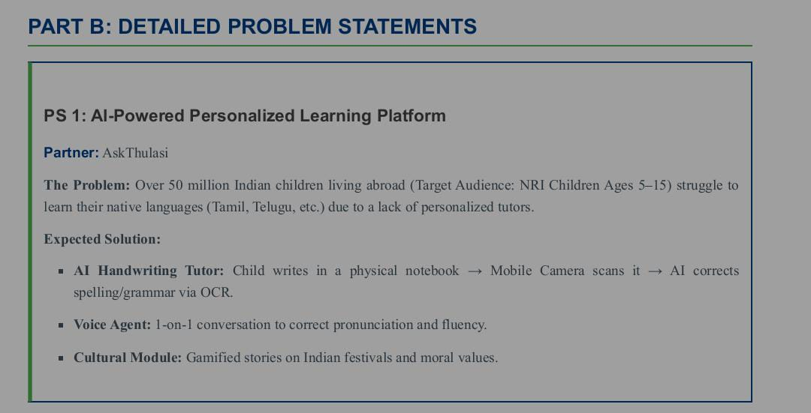

# 🚀 AI-Native Language Tutor(Ammachi-AI)

<div align="center">

 <!-- The image `abi.jpeg` is assumed to be a logo or relevant visual for the project. -->

[](https://github.com/Abishek0070/AI-Native-Language-Tutor/stargazers)
[](https://github.com/Abishek0070/AI-Native-Language-Tutor/network)
[](https://github.com/Abishek0070/AI-Native-Language-Tutor/issues)
[](LICENSE) <!-- TODO: Add actual license file (e.g., LICENSE.md) -->

**Your personal AI language companion for native-like fluency.**

[Live Demo](https://demo-link.com) <!-- TODO: Add live demo link if available --> |
[Documentation](https://docs-link.com) <!-- TODO: Add documentation link if available -->

</div>

## 📖 Overview

The AI-Native Language Tutor is an innovative application designed to provide a highly personalized and interactive language learning experience. Leveraging the power of artificial intelligence, this platform aims to simulate native-speaker interactions, offering real-time feedback, adaptive exercises, and conversational practice to accelerate language acquisition and achieve fluency. It's built as a web application with a robust Python backend at its core, enabling sophisticated AI functionalities.

## ✨ Features

-   🎯 **AI-Powered Conversational Practice**: Engage in dynamic, free-form conversations with an intelligent AI tutor.
-   🧠 **Personalized Learning Paths**: Adaptive curriculum that adjusts to your learning pace and proficiency.
-   🗣️ **Real-time Feedback & Correction**: Get immediate insights on grammar, vocabulary, and pronunciation.
-   📝 **Interactive Language Exercises**: Practice speaking, listening, reading, and writing through diverse activities.
-   📈 **Progress Tracking**: Monitor your learning journey and identify areas for improvement.
-   🌐 **Multi-Language Support**: Designed to support learning various languages.


## 🛠️ Tech Stack
```
LangChain 
LangGraph agent orchestration
LLM Brain,Groq llama ,Multimodal reasoning
Vision(Local),Qwen2-VL 
Deepgram
ElevenLabs-Emotive “Grandmother” voice
SQLite-Local-first user profiles & mastery Knowledge
FAISS + YouTube API,Cultural RAG & storytelling
MCP Tool - Youtube
Reddis(caching)
```

**Backend:**
-   **Runtime**: Python
-   **AI/ML**: Large Language Models (LLMs) integration (e.g., Groq, Hugging Face via libraries like `transformers`, `langchain`)
-   **Web Framework**: <!-- TODO: Detect specific Python web framework (e.g., Flask, FastAPI, Django) from `backend` directory content. -->

**Frontend:**
-   **User Interface**: Streamlit<!-- TODO: Add frontend technologies and badges once detected. -->

🌟 Reward & Progress Tracking

Ammachi doesn't just grade; she mentors. Our Mastery Tracker uses a unique 3-tier system:
1. The Cultural Passport (SQLite Storage)

Every child has a user_profile stored locally. As they complete modules, they earn Cultural Stamps (NFT-style digital badges) for festivals like Diwali, Pongal, or Onam.

    Table: achievements (user_id, stamp_id, date_unlocked, mastery_score).

2. Level-Up Scaffolding

The system tracks a rolling average of the last 5 interactions.

    Score > 80%: Prompts Ammachi to level up the language difficulty (e.g., from Tanglish to Bilingual).

    Score < 50%: Triggers "Gentle Remediation" mode where the AI simplifies vocabulary.

3. The "Story Unlock" Reward

When a child completes a handwriting task (e.g., writing "அம்மா"), the Cultural Discovery Agent triggers the YouTube Data API to play a related animated folklore story.

🚀 Key Modules
✍️ Handwriting Tutor

Unlike traditional OCR, we analyze the process. By tracking the hand movement via MediaPipe, we detect if a child draws a letter in the correct stroke order. If they start from the bottom instead of the top, Ammachi intervenes: "Kanna, start from the top like a little mountain!"
🗣️ Inclusive Voice Agent

Standard AI cuts off slow speakers. Our Adaptive Endpointing increases the silence timeout to 3 seconds, providing a safe space for children with stutters or language anxiety to finish their thoughts.
🎡 Cultural RAG

We use FAISS to store local metadata about festivals. When a child asks about a festival, the agent retrieves the facts and presents a "Knowledge Challenge" to earn the next stamp.

## 🚀 Quick Start

Follow these steps to set up and run the AI-Native Language Tutor locally.

### Prerequisites
-   **Python** (version 3.8 or higher recommended)
-   **Git** (for cloning the repository)
-   An **API Key** for your chosen Large Language Model provider (e.g., OpenAI API Key).

### Installation

1.  **Clone the repository**
    ```bash
    git clone https://github.com/Abishek0070/AI-Native-Language-Tutor.git
    cd AI-Native-Language-Tutor
    ```

2.  **Navigate to the backend and install dependencies**
    ```bash
    cd backend
    pip install -r requirements.txt
    ```
    <!-- TODO: Confirm `requirements.txt` path and existence within `backend`. -->

3.  **Environment setup**
    Create a `.env` file in the `backend` directory based on `.env.example` (if available).
    ```bash
    cp .env.example .env # If .env.example exists, otherwise create .env manually
    ```
    Configure your environment variables, especially the API key for the AI service:
    ```ini
    # .env
    GROQ_API_KEY="your_api_key_here"
    DEEPGRAM_API_KEY="your_api_key_here"
    ELEVENLABS_API_KEY="your_api_key_here"
    # Add other environment variables as needed (e.g., for different LLMs, database connections)
    ```
    <!-- TODO: List actual detected environment variables from `.env.example` or code. -->

4.  **Start development server**
    ```bash
    # From the 'backend' directory
    python main.py
    # OR if using FastAPI/Uvicorn:
    # uvicorn main:app --reload --port 8000
    ```
    <!-- TODO: Detect actual entry point file (e.g., `main.py`, `app.py`) and specific start command. -->

5.  **Open your browser**
    Visit `http://localhost:[detected-port]` (e.g., `http://localhost:8000` for the backend API). If a frontend exists, it would typically run on a different port (e.g., `http://localhost:3000`).

## 📁 Project Structure

```
AI-Native-Language-Tutor/
├── .gitignore                # Specifies intentionally untracked files to ignore
├── README.md                 # Project README file
├── abi.jpeg                  # An image file, possibly a project logo or asset
├── ammachi/                  # (Empty directory, purpose currently unknown)
└── backend/                  # Contains the Python backend application code
    ├── requirements.txt      # (Assumed) Lists Python project dependencies
    ├── main.py               # (Assumed) Main application entry point for the backend
    └── [other-backend-files] # Configuration, routes, utility functions, AI models, etc.
```
<!-- TODO: Refine `backend` subdirectory structure once more details are available. -->

## ⚙️ Configuration

### Environment Variables
Key environment variables are used to configure the application, especially for integrating with external AI services.

| Variable        | Description                                       | Default     | Required |
|-----------------|---------------------------------------------------|-------------|----------|
| `GROQ_API_KEY`| Your API key for accessing the OpenAI service.    | `None`      | Yes      |
| `PORT`          | The port on which the backend server will run.    | `8000`      | No       |
| `DEBUG`         | Enable debug mode for the backend.                | `False`     | No       |
<!-- TODO: Add actual detected environment variables from `.env.example` or code. -->

### Configuration Files
<!-- TODO: List detected specific configuration files within the `backend` directory (e.g., `config.py`, `settings.py`) and their purposes. -->

## 🔧 Development

### Available Scripts
To run the backend development server:
```bash
cd backend
python main.py # Or the specific command to start your backend framework
```
<!-- TODO: List actual detected development scripts from `package.json` (if JS) or specific Python run commands. -->

### Development Workflow
Contributions and development typically involve modifying files within the `backend/` directory, updating `requirements.txt` for new dependencies, and restarting the server to see changes.

## 🧪 Testing

<!-- TODO: If testing framework (e.g., `pytest`) and tests are detected, add relevant commands and instructions. -->
Currently, no explicit testing framework or test commands are detected in the provided structure.

## 🚀 Deployment

### Production Build
For deploying the Python backend:
```bash
# Ensure all dependencies are installed
cd backend
pip install -r requirements.txt

# Start the application using a production-ready WSGI server like Gunicorn or Uvicorn
# gunicorn -w 4 -k uvicorn.workers.UvicornWorker main:app -b 0.0.0.0:8000
```
<!-- TODO: Provide specific deployment commands/instructions based on detected framework. -->

### Deployment Options
This application can be deployed on various cloud platforms that support Python applications, such as Heroku, AWS EC2, Google Cloud Run, or by containerizing it with Docker.

## 📚 API Reference

The backend exposes a set of RESTful APIs to power the language tutor application.

### Authentication
<!-- TODO: If an authentication system is implemented, describe it here (e.g., JWT, API Key). -->

### Endpoints
<!-- TODO: List and describe key API endpoints based on route analysis from backend code. Example: -->
-   `POST /chat/message`: Send a message to the AI tutor and receive a response.
    -   **Request Body**: `{ "user_message": "Hello, how are you?", "language": "en" }`
    -   **Response**: `{ "tutor_response": "I'm doing great, thanks for asking!" }`
-   `GET /progress`: Retrieve user learning progress.
-   `POST /exercise/submit`: Submit an exercise for evaluation.


### Development Setup for Contributors
Ensure you have Python 3.8+ and pip installed. Clone the repository, navigate to the `backend` directory, and install dependencies as described in the [Installation](#installation) section.


## 📞 Support & Contact

-   📧 Email: [abishekbalamurugan858@gmail.com] <!-- TODO: Add a contact email address -->
-   🐛 Issues: [GitHub Issues](https://github.com/Abishek0070/AI-Native-Language-Tutor/issues)
-   💬 Discussions: [GitHub Discussions](https://github.com/Abishek0070/AI-Native-Language-Tutor/discussions) <!-- TODO: Enable GitHub Discussions if desired -->

---

<div align="center">

**⭐ Star this repo if you find it helpful!**

Made with ❤️ by [Abishek0070]

</div>
